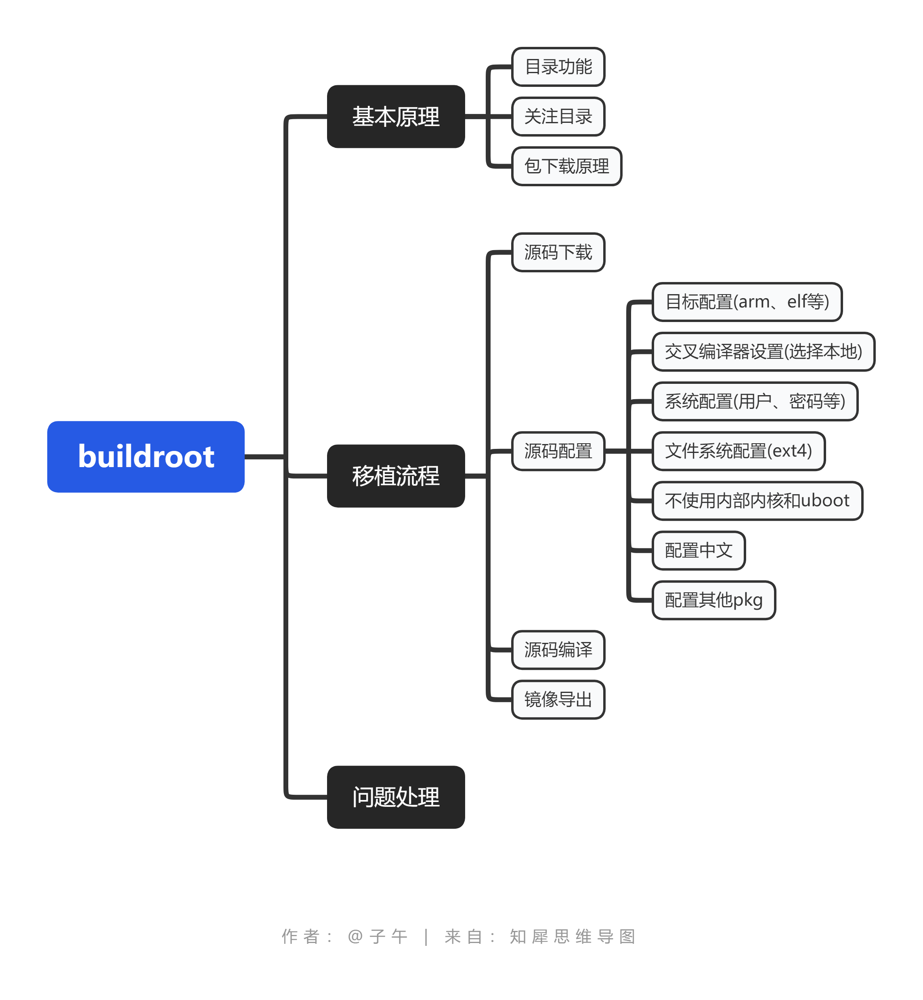
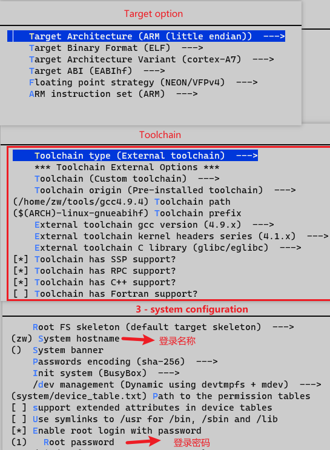
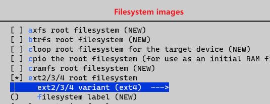

方案2 - buildroot
======================

1 buildroot移植
-----------------------

.. code-block:: c

    # 导出环境变量
    source /opt/xxx

    # 下载源码 buildroot-2019.02.6
    https://buildroot.org/downloads/

    # 配置源码(第一次先按下图编译最小系统)
    make menuconfig

    # 编译源码
    sudo make

    # 镜像输出位置
    buildroot/output/images/

2 常见问题
-----------------

2.1 如何快速下载
********************

    在一台机器下载后, 将 ``buildroot/dl`` 目录拷贝到新的的源码中, 这样可以减少
    下载时间, 来加速编译

2.1 下载时卡住
******************

2.2 新增外部文件

2.3 
