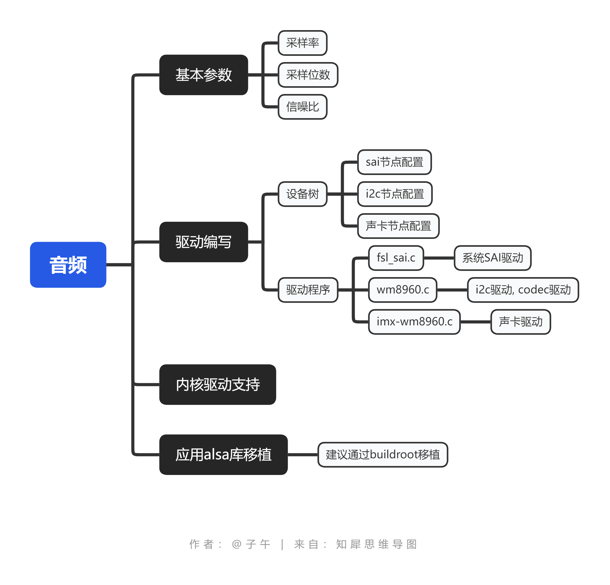

音频驱动
=================

1 基本介绍
----------------

1.1 缩略语
******************
============= =========================== ======================
LRCK          left right clock            iis左右时钟
BCLK          bit clock                   位时钟
SAI           synchronous audo interface  同步音频接口
============= =========================== ======================

1.2 基本参数
*************

================== ============================= ================================
常用采样率          8K/44.1K/48K/192K/384K/268K   8K为电话常用, 44.1K为CD常用
采样位数            8/16/32/24/32 位              32位称为HIFI
信噪比                                            DAC和ADC都有, 标准信号质量
================== ============================= ================================

2 硬件相关
----------------

2.1 iis接口
*******************

=================== =====================================================================
WS/LRCK             声道选择时钟, 也称帧时钟,WS=1表示传输的左声道数据, WS=0表示右声道数据
BCLK/SCK            位时钟, 音频每一位数据都对应一个SCK, SCK = 2 * 采样率 * 采样位数
MCLK                MCLK为采样率的256/384倍, 常见手册MCLK=256fs
DATA_RECORD         录音数据引脚 - iis格式, 有左右对齐之说
DATA_APLAY          播放数据引脚 - iis格式, 有左右对齐之说
SCL                 i2c时钟线 
SDA                 i2c数据线
=================== =====================================================================

3 驱动说明
----------------

    音频驱动一共分为3部分
       1. 系统部分, soc内部sai的驱动程序
       2. codec驱动, 既i2c控制的驱动
       3. 声卡驱动, 将codec与sai绑定

4 alsa库移植
-----------------

    编写程序控制/dev/snd/下的节点过于麻烦, 因此上层制作了alsa库来方便开发,
    alsa库的移植到pkg中查看