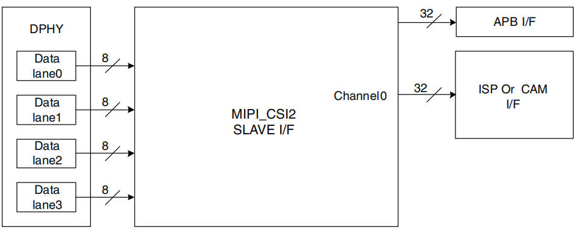

总线音书
===========

1 参考资料
-----------

https://blog.csdn.net/m0_46535940/article/details/126327889

2 硬件说明
-----------

摄像头相关一共有4个硬件 ``sensor, mipi phy, mipi csi, isp``

sensor => mipi phy => mipi csi => isp

2.1 mipi dphy
****************

- 工作模式: 高速模式(HS), 低功耗模式(LP)
- 模块组成: data lane + clock lane + common block

2.2 mipi csi控制器
*******************

- MIPI控制器支持RAW、YUV、RGB图像格式
- 内置SRAM存储4K
- 图像以帧为单位, 一帧结束后生成垂直同步中断
- 与ISP相关的配置(数据格式, 分辨率等), 需要进入空闲状态配置

=============================== ==========================================
寄存器                           描述
reg_common                      lane数量配置 + 复位 + 使能
reg_clock_ctrl                  pixel clock + 
reg_interrupt                   中断
reg_phy_satus                   lane状态(ULPS, stop)
reg_phy_ctrl                    lane使能, 电压控制, 
reg_isp_config                  像素模式选择(4像素、双、单)、图像格式、分辨率
=============================== ==========================================

.. note:: 中断说明

    - FS packet, 收到起始包中断
    - FE packet, 收到结束包中断
    - 各种出错中断
    - 图像FIFO溢出中断

3 内核配置
-----------

4 文件分析
------------

==================================== ====================================
kernel/drivers/clk/imx/clk-imx8mp.c  时钟文件关于clk大数组的初始化
==================================== ====================================