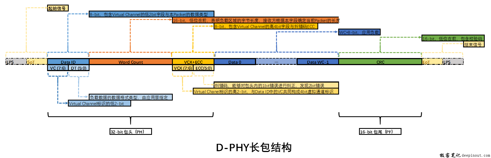
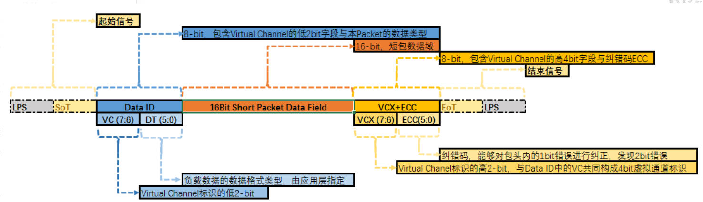

CSI协议
==========

1 基本概念
------------

1.1 术语
**********

============== =============================================== =========================================================
缩写/术语      全写                                             描述
SoT            start of transmission                           传输启动信号
EoT            end of transmission                             传输停止信号
FS             frame start
FE             frame end
LS             line start
LE             line END
PH             packet head                                     包头
PF             packet footer                                   包尾
HS             high speed                                      DPHY的传输模式之一
LP             low power                                       HPHY的传输模式之一
VC             virtual channel                                 标识多路独立数据流, DPHY最高支持16个虚拟通道
ST             start of transmission
ET             end of transmission
LPS            low power state
LLP            low level protocol                              sot与eot直接的数据包协议, 单位为字节
PBPF           pixel to byte packing formats                   将数据按照一定次序, 切割成8bit数据
WC             word count                                      数量
============== =============================================== =========================================================

.. note:: 
    - pixel, 像素数据, 原始图像数据
    - data, 传输数据, 经过mipi模块切割加上包头包尾的数据

1.2 基础知识
*************

- CSI-2定义物理层支持DPHY和CPHY两种
- DPHY工作在两种模式, HS(速率为最高4.5G, lane以差分工作), LP(速率为10Mbps, lane以普通信号线工作)
- mipi工作模式: burst(HS模式)、control(LP)、escape(LP, 可以使用一些特殊功能)
- 一个数据包传输一帧图像的一行数据, 每个长包就代表了行同步(所以有的硬件没有行同步中断)
- 每帧图像必须开始于帧开始包(FRAME START PACKET), 结束于帧结束包(FRAME END PACKET), 这两个都属于同步短包
- 行同步短包是可选得, 对于RGB, YUV, RAW格式数据, 每个数据长包里必须包含一整行数据, 接收端利用字节树解出行同步信号

2 帧格式
---------

- SOT和EOT不属于数据帧, 是由lane0产生的信号, 例如i2c的起始信号和停止信号

===== ====== ========
结构   大小   描述
PH    32位   包头
DATA  N      数据位
PF    16位   CRC校验
===== ====== ========

2.1 长帧PH
***********

长帧PH由 DATA ID + word count + ECC构成, DATA ID由VCC + DT构成, ECC由 VCX + ECC构成

===== ====== ==========================
字段   大小   描述
VCC   2位    virtual channel标识的低2位
DT    6位    负载数据的数据类型
COUNT 16位   数据端长度
VCX   2位    virtual高2位
ECC   6位    纠错码
===== ====== ==========================

2.2 短帧PH
***********

短帧的数据区固定为2个字节, 所以PH只有DATA ID, 短包只包含一个32位(4Byte)包头

===== ====== ==========================
字段   大小   描述
VCC   2位    virtual channel标识的低2位
DT    6位    负载数据的数据类型
===== ====== ==========================

=========== ===================
0x00        frame start code
0x01        frame end code
0x02        line start(可选)
0x03        line end(可选)
0x04 - 0x07 预留
=========== ===================

2.3 虚拟通道
************

例如一路mipi接了多路摄像头, 为了区分没路数据, 用虚拟通道来标识

2.4 数据类型
*************

DT位有6位, 可以表示多种数据类型, 比如YUV420-8bit, RGB888, RAW等